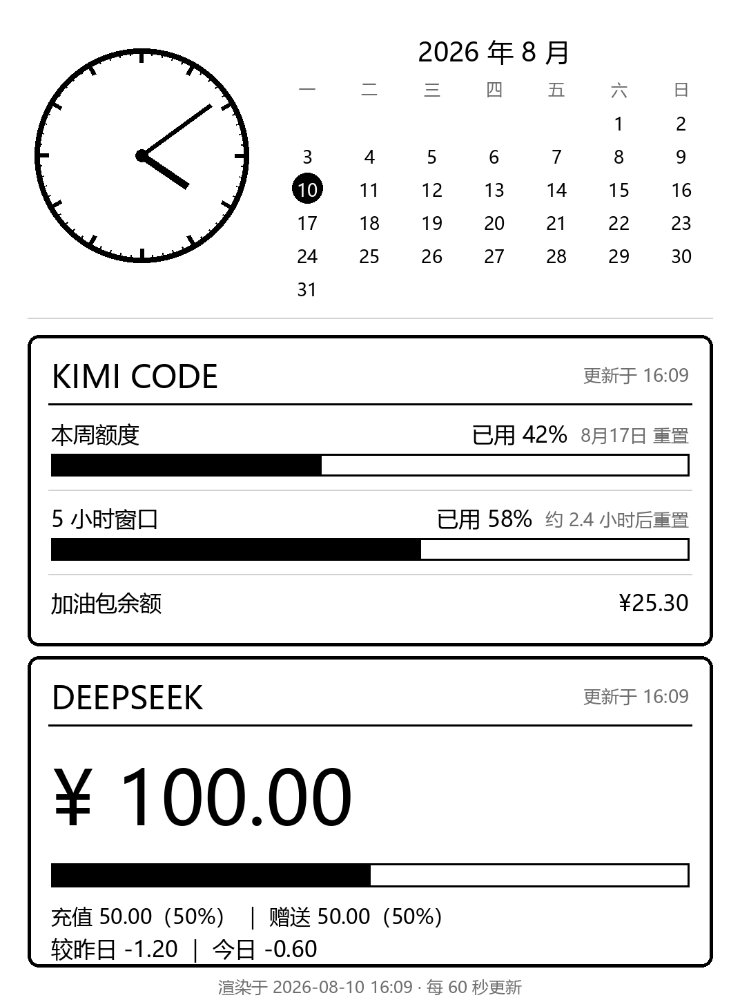

# Old-Kindle-AI-Usage-Display

把闲置的 Kindle Paperwhite 3（第 7 代）改造成常亮桌面仪表盘：实时显示 **Kimi Code 订阅用量**（本周额度 / 5 小时窗口 / 加油包）和 **DeepSeek 余额**，外加模拟表盘时钟和当月日历。



> 图为服务器渲染的 1072×1448 灰度图（演示数据）。取数失败时会沿用缓存数据渲染，并在面板右上角显示 ⚠ 角标提示。

横屏模式（KUAL 一键切换，支持顺/逆时针两个方向）：


## 特性

- **Kindle 端零业务逻辑**：取数、渲染、时钟、日历全部在服务器，Kindle 只负责每分钟下载一张图并刷屏
- **Kimi Code 订阅用量**：本周额度百分比 + 进度条、5 小时频限窗口、加油包余额，含重置时间
- **DeepSeek 余额**：充值/赠送构成 + 较昨日/今日变化（服务器每天存快照到 `history.json`）
- **横竖屏切换**：竖屏 / 顺时针横屏 / 逆时针横屏，KUAL 菜单一键切换（横版为独立排版，不是简单旋转）
- **WiFi 状态图标**：Kindle 端左上角常显（扇形：实心=已连接，斜杠=未连接），配合告警横幅一眼区分断网还是服务器问题
- **两级失败兜底**：服务器取数失败 → 沿用旧数据渲染（仅 ⚠ 角标，不标灰）；Kindle 拉取失败 → 显示本地缓存图 + 顶部告警横幅。永不黑屏
- **低功耗友好**：每分钟局部刷新，每小时一次全刷清残影；Kindle 常亮插电运行，背光自动关闭
- **API Key 不出服务器**：Kindle 只接触一个带随机口令的图片 URL

## 架构

```
┌──────────────┐  每分钟 wget 一张图   ┌─────────────────────┐
│  Kindle PW3   │ ◄── HTTP(域名,80) ──│  你的服务器            │
│  越狱 + fbink │    dash.png          │  PM2 常驻 render.py   │
│  只下载+刷屏  │                      │  Pillow 渲染          │
└──────────────┘                      │  ↕ 调余额 API         │
                                      │  Kimi / DeepSeek      │
                                      └─────────────────────┘
```

数据来源（均为官方接口，Bearer API Key 认证）：

| 平台 | 接口 |
|---|---|
| Kimi Code（订阅） | `GET https://api.kimi.com/coding/v1/usages` |
| DeepSeek | `GET https://api.deepseek.com/user/balance` |

## 安装（三篇详细教程，按顺序做）

1. **[docs/1-jailbreak.md](docs/1-jailbreak.md)** — Kindle 越狱（LanguageBreak，适用固件 ≤ 5.16.2.1.1）+ 装 KUAL / fbink / 屏蔽 OTA
2. **[docs/2-server-setup.md](docs/2-server-setup.md)** — 服务器端：uv 建环境 → 填 `config.env` → nginx 加 5 行 → PM2 托管
3. **[docs/3-kindle-setup.md](docs/3-kindle-setup.md)** — Kindle 端：USB 拷文件 → 填 `IMAGE_URL` → KUAL 一键启动

前提：一台已越狱的 Kindle PW3、一台有公网 HTTP 站点（nginx，80 端口）的服务器、两个平台的 API Key。

## 配置

全部配置集中在仓库根的 [`config.env`](config.env)（入库、占位符、部署时手改）：

| 字段 | 用途 | 哪里用 |
|---|---|---|
| `KIMI_CODE_API_KEY` | Kimi Code 控制台签发的 Key（与开放平台 Key 不通用） | 服务器 |
| `DEEPSEEK_API_KEY` | DeepSeek 开放平台 API Key | 服务器 |
| `FONT_PATH` | 中文字体路径 | 服务器 |
| `IMAGE_URL` | 带口令的图片地址（`YOUR_TOKEN` 与 nginx 路径一致） | Kindle |
| `FETCH_INTERVAL` / `FULL_REFRESH_EVERY` / `TIMEZONE` | 刷新间隔 / 全刷频率 / 时区 | 可选 |

> 填完真实值后执行 `git update-index --skip-worktree config.env`，防止误提交、避免 pull 冲突。

## 仓库结构

```
├── config.env            # ★ 唯一配置文件（入库、占位符）
├── pyproject.toml        # 依赖声明（仅 Pillow），服务器端用 uv 管理环境
├── docs/                 # 三篇安装教程
├── server/
│   ├── render.py         # 取数 + 渲染 + 常驻循环（仅依赖 Pillow）
│   ├── nginx.conf.example
│   └── ecosystem.config.js.example   # PM2 模板
├── kindle/
│   ├── dashboard.sh      # Kindle 主循环（busybox sh + fbink，WiFi 判定 + 方向选择）
│   ├── warning.png       # 拉取失败时的顶部告警横幅
│   ├── icons/            # WiFi 状态图标（make_icons.py 生成）
│   └── kual/ai-dashboard/   # KUAL 菜单扩展（竖屏/横屏顺/逆时针/关闭）
├── tools/
│   ├── make_demo.py      # 用假数据渲染效果图（也可当渲染冒烟测试）
│   ├── make_warning.py   # 重新生成 warning.png
│   ├── make_icons.py     # 生成 WiFi 图标 + 样式候选图
│   ├── powertest.sh      # 休眠方案可行性测试（方案已否决，留档）
│   └── buttontest.sh     # 电源键检测枚举（同上，留档）
└── assets/               # README 效果图（含横版）
```

## 开发备注

- 改布局只动 `server/render.py`；改完跑 `python tools/make_demo.py` 立即预览效果，无需真机
- Kindle 端排障：看 `/mnt/us/dashboard/dashboard.log`；服务器端排障：`pm2 logs kindle-dash`

## License

MIT
